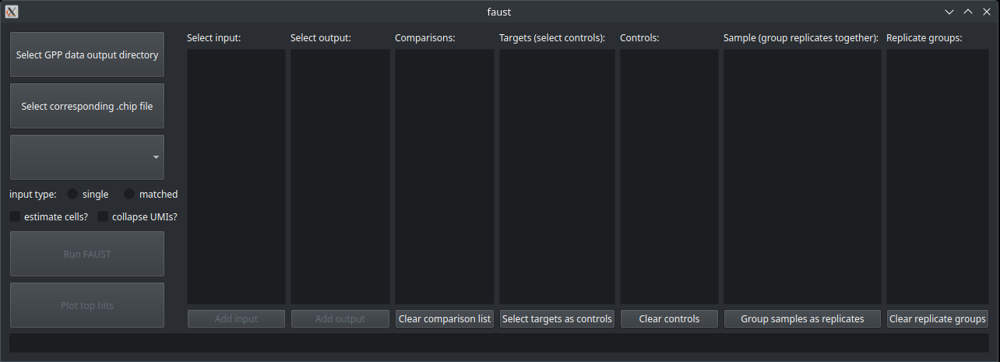

==============================
Graphical User Interface (GUI)
==============================

FAUST has a basic graphical user interface (GUI) that will allow you to run FAUST without interacting with the API. 

The GUI can be started on the command line with the commands:

::

    faust gui

Note that this GUI will depend on the following additional dependencies

::

    matplotlib
    PySide6

Once you start the GUI, you will see a screen that looks like this: 

Now you will have to load counts data. The FAUST GUI expects data to be in the format generated by `PoolQ <https://portals.broadinstitute.org/gpp/public/software/poolq>`_, which
is the typical output format you would receive your data if they were processed by the Broad Institute Gene Perturbation Platform (GPP). The relevant folder is usually the "ibar-counts" folder,
which will contain separate counts matrices for each distinct ibar, or UMI. Each count matrix will be a tab-delimited file with each row representing a distinct guide, and columns representing 
the counts for that guide (having the UMI corresponding to the file) in a particular sample.  

