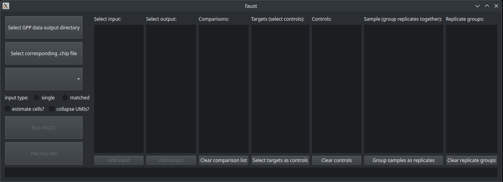

==============================
Graphical User Interface (GUI)
==============================

FAUST has a basic graphical user interface (GUI) that will allow you to run FAUST without interacting with the API. 

The GUI can be started on the command line with the commands

::

    faust gui

Note that this GUI will depend on the following additional dependencies

::

    matplotlib
    PySide6
