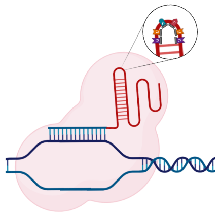

====
UMIs
====

"Unique molecular identifiers" or UMIs are, in the FITS/FAUST framework, random sequences in the hairpin portion of the sgRNA. 

   The "UMI" is a short, variable sequence, typically in the hairpin region of the sgRNA. 

These do not affect gRNA targeting, but allow increased statistical power for a fixed-size gRNA library. Essentially, a library with 3 gRNA targeting a particular gene, where each gRNA has one of 96 UMIs has effectively 288 gRNAs targeting that gene. In certain situations, this can vastly increase our statistical power.
